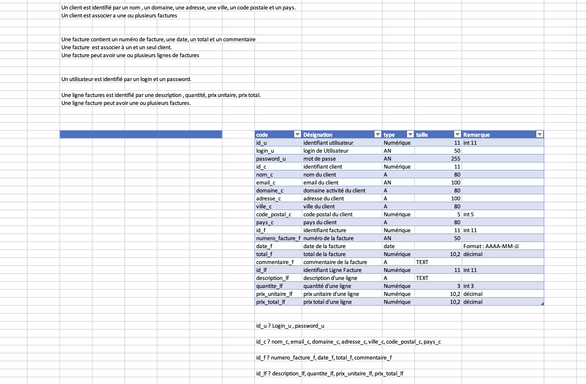
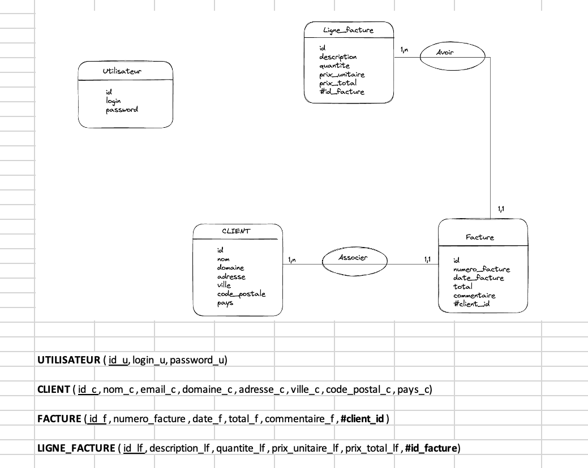
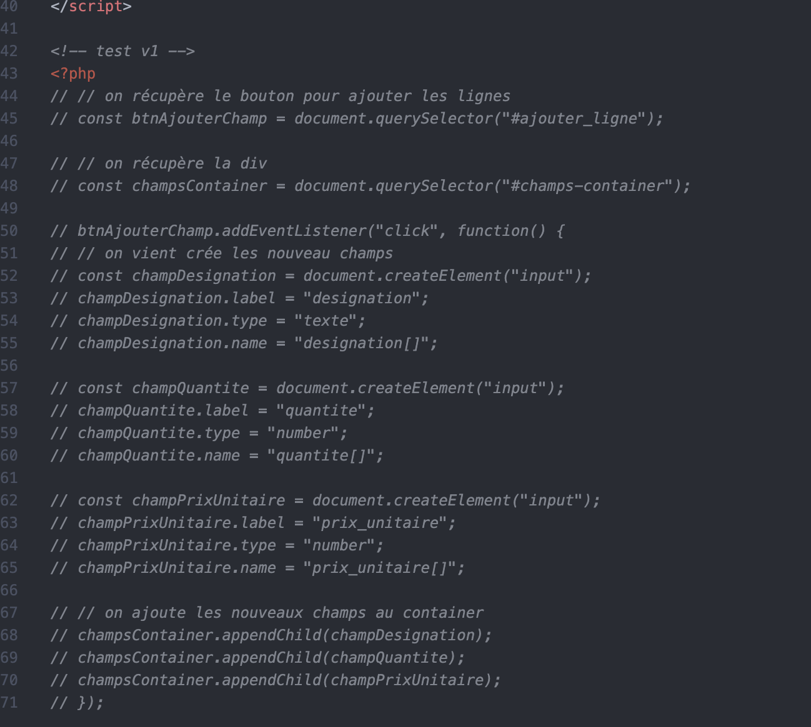
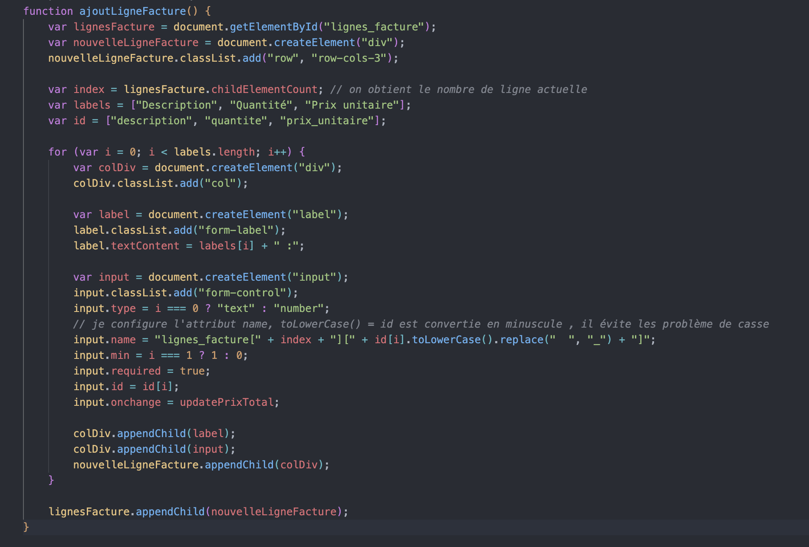
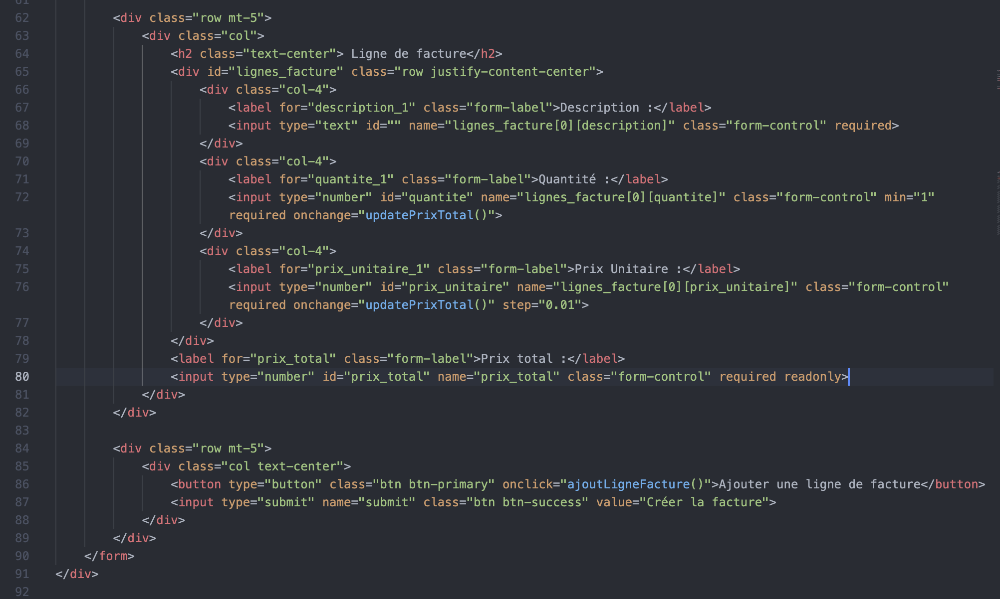

# Application de Gestion d'entreprise avec édition de facture

## Description Du Projet

Le projet consiste en une application de gestion d'entreprise permettant d'ajouter des clients et de saisir des factures. Les factures peuvent être enregistrées sans besoin de PDF(que j'ai finalement réalisé pour être plus cohérent à la réalité). L'application offre également une page de statistiques qui affiche le chiffre d'affaires de l'année en cours.

## Les fonctionnalités

* Créer une page pour ce connecter en tant Administrateur.
* Créer Un CRUD pour les clients.
* Créer une page pour pouvoir crée des factures.
* Pouvoir voir une facture mais aussi l'éditer sous forme de PDF.
* Créer Une page statistique pour voir le CA en cours de chaques Clients.

## Les Étapes pour réaliser ce projet 

1. Identifiaction des besoins clients en réalisant un MCD, MLD, MPD.
2. Création de La Base de donnée via phpMyAdmin.
3. Création de la page Administration en ce connectant.
4. Première page d'accueil (Futur Tableau de bord pour voir les dernières factures crée et le chiffre d'affaire pour chaque client).
5. Page Client où l'on peut afficher les informations du client mais aussi le modifié où créer un nouveau client.
6. Page facture Pour pouvoir crée des factures mais aussi un bouton pour pouvoir rechercher une facture en fonction du client choisis.
7. Une page statistique pour pouvoir affiché le CA de chaque clients en le selectionnant via une liste déroulantes qui affiche tous les clients.
8. Un bouton pour pouvoir ce déconnecter de la session.

### MCD ET MLD

## Problèmatique rencontrée au cours de ce projet

1. Le plus gros problème de ce projet a été de pouvoir ajouter des lignes pour une facture. J'ai dû utiliser JavaScript pour pouvoir créer un bouton qui ajoute des lignes pour une facture. La deuxième problématique a été d'enregistrer dans la BDD les nouvelles lignes que l'on ajoute. J'ai dû effectuer une boucle pour prendre en compte chaque ligne ajoutée.

2. Le deuxième problème rencontré, mais qui était optionnel pour le projet, a été de pouvoir télécharger les factures sous forme de PDF. J'ai donc dû me documenter et chercher comment faire. J'ai trouvé le logiciel FPDF qui génère des fichiers sous forme de PDF en PHP. Il y avait aussi "wkhtmltopdf", mais j'ai préféré utiliser FPDF car je trouvais cela plus facile.

## Présentation de quelque éssais en JavaScript pour ajouter des lignes

### Version 1

Première version pour ajouter une ligne pour la facture, que j'ai finalement pas garder suite à certain bug que je n'arrivais pas à résoudre.

### Version final 

Version final que j'ai finalement garder après plusieurs recherche sur internet et plusieurs essais, j'ai finalement réussie avec cette version.

Voici le formulaire qui va avec pour l'ajout de ligne :

