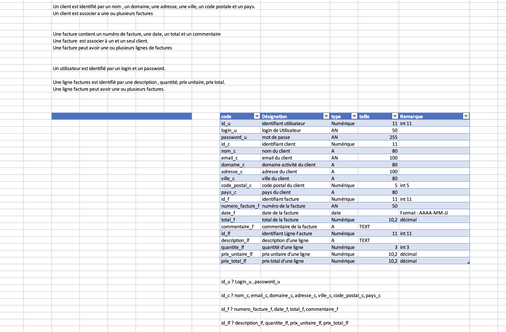
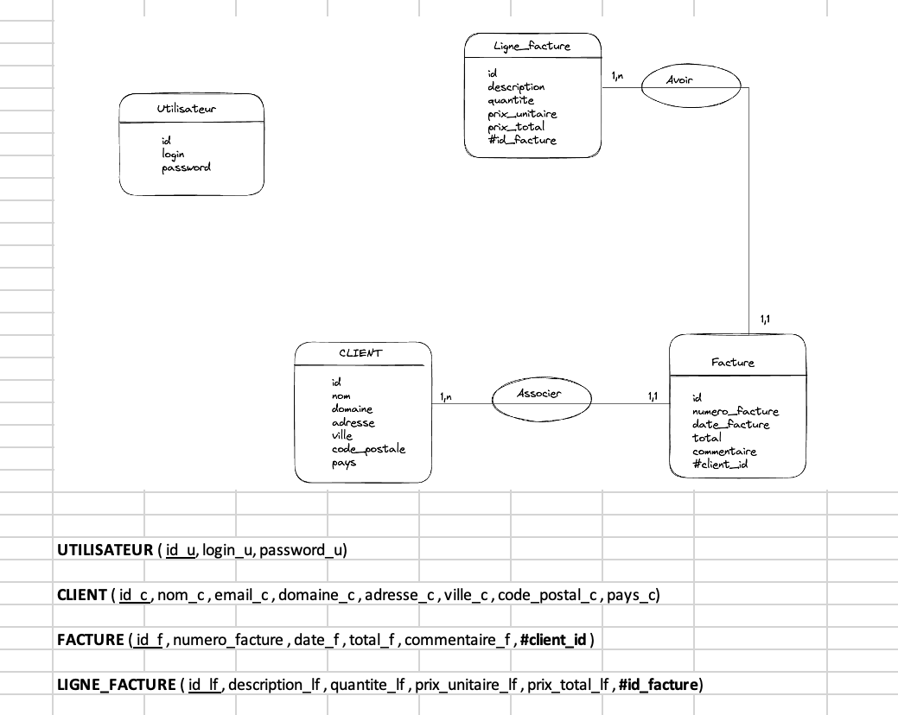

# Application de Gestion d'entreprise avec édition de factures

## Description Du Projet

Le projet consiste en une application de gestion d'entreprise permettant d'ajouter des clients et de saisir des factures. Les factures peuvent être enregistrées sans besoin de PDF (que j'ai finalement réalisé pour être plus cohérent à la réalité). L'application offre également une page de statistiques qui affiche le chiffre d'affaires de l'année en cours.

## Les fonctionnalités

- Créer une page pour se connecter en tant qu'administrateur.
- Créer un CRUD pour les clients.
- Créer une page pour pouvoir créer des factures.
- Pouvoir voir une facture mais aussi l'éditer sous forme de PDF.
- Créer une page statistique pour voir le chiffre d'affaires en cours de chaque client.

## Configuration

Pour configurer l'accès à MySQL, créer dans le dossier config/ un fichier db.ini avec la structure suivante :

## Les Étapes pour réaliser ce projet

1. Identification des besoins clients en réalisant un MCD, MLD, MPD.
2. Création de la base de données via phpMyAdmin.
3. Création de la page d'administration pour se connecter.
4. Première page d'accueil (futur tableau de bord pour voir les dernières factures créées et le chiffre d'affaires pour chaque client).
5. Page client où l'on peut afficher les informations du client mais aussi les modifier ou créer un nouveau client.
6. Page facture pour pouvoir créer des factures mais aussi un bouton pour pouvoir rechercher une facture en fonction du client choisi.
7. Une page statistique pour pouvoir afficher le chiffre d'affaires de chaque client en le sélectionnant via une liste déroulante qui affiche tous les clients.
8. Un bouton pour pouvoir se déconnecter de la session.

### MCD ET MLD

## Page de connexion

Pour ce connecter utiliser le login : admin et le mdp : admin.

## Problèmatique rencontrée au cours de ce projet

1. Le plus gros problème de ce projet a été de pouvoir ajouter des lignes pour une facture. J'ai dû utiliser JavaScript pour pouvoir créer un bouton qui ajoute des lignes pour une facture. La deuxième problématique a été d'enregistrer dans la BDD les nouvelles lignes que l'on ajoute. J'ai dû effectuer une boucle pour prendre en compte chaque ligne ajoutée.

2. Le deuxième problème rencontré, mais qui était optionnel pour le projet, a été de pouvoir télécharger les factures sous forme de PDF. J'ai donc dû me documenter et chercher comment faire. J'ai trouvé le logiciel FPDF qui génère des fichiers sous forme de PDF en PHP. Il y avait aussi "wkhtmltopdf", mais j'ai préféré utiliser FPDF car je trouvais cela plus facile.

## Présentation de quelque éssais en JavaScript pour ajouter des lignes

### Version 1

Première version pour ajouter une ligne pour la facture, que j'ai finalement pas garder suite à certain bug que je n'arrivais pas à résoudre.

### Version final

Version final que j'ai finalement garder après plusieurs recherche sur internet et plusieurs essais, j'ai finalement réussie avec cette version.

Voici le formulaire qui va avec pour l'ajout de ligne :

Pour mon champ de formulaire permettant d'ajouter des lignes pour la description, la quantité et le prix unitaire, j'ai dû utiliser un tableau associatif. Le tableau principal est appelé "lignes_facture" et l'index 0 fait référence à la première ligne de la facture. Ensuite, la clé "quantite" est utilisée pour identifier le champ de saisie pour la quantité dans cette première ligne de facture, de même pour la "description" et le "prix_unitaire".

Grâce à ce tableau, je peux stocker plusieurs lignes de factures dans le formulaire, car chaque ligne est identifiée par un index différent. Cela permettra de récupérer les données de chaque ligne de facture lors de la soumission du formulaire pour créer une facture complète avec toutes les lignes.

## Amélioration du Projet pour l'avenir

J'aimerais par la suite développer beaucoup plus l'application en ajoutant des devis qui seront ensuite automatiquement reliés à une facture. Je souhaite également ajouter plusieurs fonctionnalités telles que la possibilité de filtrer le chiffre d'affaires en fonction du mois ou de l'année antérieure, améliorer l'esthétique de la facture et offrir la possibilité de rajouter la TVA pour les factures et devis.
